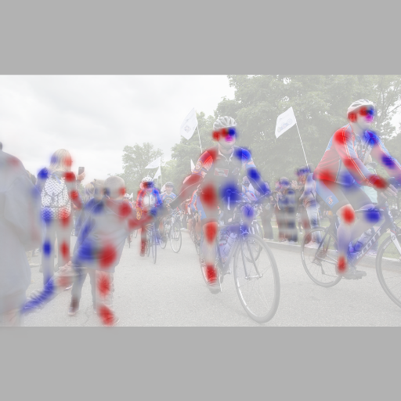
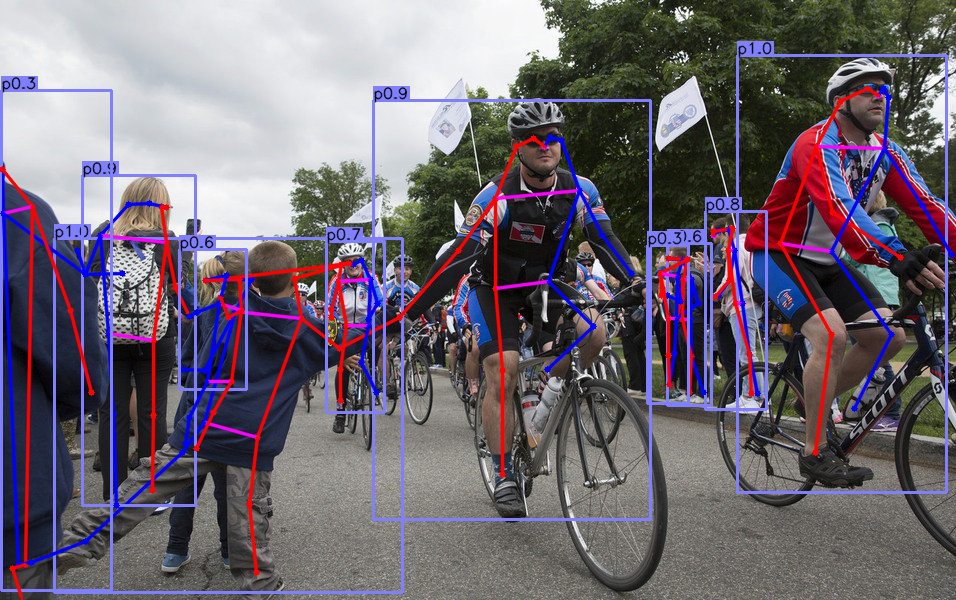

## Installation

Please refer to [INSTALL.md](readme/INSTALL.md) for installation instructions.

## Use CenterNet

We support demo for image/ image folder, video, and webcam. 

First, download the models (By default, [ctdet_coco_dla_2x](https://drive.google.com/open?id=1pl_-ael8wERdUREEnaIfqOV_VF2bEVRT) for detection and 
[multi_pose_dla_3x](https://drive.google.com/open?id=1PO1Ax_GDtjiemEmDVD7oPWwqQkUu28PI) for human pose estimation) 
from the [Model zoo](readme/MODEL_ZOO.md) and put them in `CenterNet_ROOT/models/`.

For object detection on images/ video, run:

~~~
python demo.py ctdet --demo /path/to/image/or/folder/or/video --load_model ../models/ctdet_coco_dla_2x.pth
~~~
We provide example images in `CenterNet_ROOT/images/` (from [Detectron](https://github.com/facebookresearch/Detectron/tree/master/demo)). If set up correctly, the output should look like

   

For webcam demo, run     

~~~
python demo.py ctdet --demo webcam --load_model ../models/ctdet_coco_dla_2x.pth
~~~

Similarly, for human pose estimation, run:

~~~
python demo.py multi_pose --demo /path/to/image/or/folder/or/video/or/webcam --load_model ../models/multi_pose_dla_3x.pth
~~~
The result for the example images should look like:

      

You can add `--debug 2` to visualize the heatmap outputs.
You can add `--flip_test` for flip test.

To use this CenterNet in your own project, you can 

~~~
import sys
CENTERNET_PATH = /path/to/CenterNet/src/lib/
sys.path.insert(0, CENTERNET_PATH)

from detectors.detector_factory import detector_factory
from opts import opts

MODEL_PATH = /path/to/model
TASK = 'ctdet' # or 'multi_pose' for human pose estimation
opt = opts().init('{} --load_model {}'.format(TASK, MODEL_PATH).split(' '))
detector = detector_factory[opt.task](opt)

img = image/or/path/to/your/image/
ret = detector.run(img)['results']
~~~
`ret` will be a python dict: `{category_id : [[x1, y1, x2, y2, score], ...], }`
